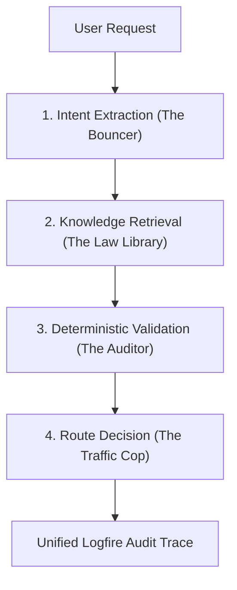

# Autonomous Procurement Guardrail (APG)

### **The Zero-Trust Decision Firewall for Agentic Procurement**

Autonomous AI agents in procurement represent a massive efficiency gain, but they also introduce unprecedented financial and compliance risks. The **Autonomous Procurement Guardrail (APG)** is a production-grade safety layer that intercepts agent purchase intents, validates them against corporate policies, and ensures every transaction is auditable and compliant.

---

## Orchestrating Auditor-Grade Security

Unlike traditional system prompts that are prone to hallucinations, the APG uses a multi-layered, deterministic architecture to ensure **zero-liability** execution.

- **Deterministic Validation**: Crucial decisions (like amount thresholds) are handled by strict Python logic, not the LLM.
- **Financial Precision**: Every transaction uses `Decimal` arithmetic to prevent floating-point rounding errors.
- **Hybrid Retrieval**: Powered by Qdrant, we use semantic search combined with hard categorical filtering so no policy is ever missed.
- **Deep Observability**: Every step is traced with Pydantic Logfire, providing a CFO-ready audit trail for every single purchase.

---

## Architectural Deep Dive

The system operates as a **LangGraph State Machine**, moving through four distinct stages:



### Modular Components
- **`schema.py`**: Strict Pydantic V2 definitions for immutability and data integrity.
- **`vector_db.py`**: Manages the Qdrant knowledge base with in-memory persistence and hybrid search.
- **`nodes.py`**: Individual operational nodes (LLM intent extraction, Deterministic guardrail matching).
- **`graph.py`**: The LangGraph orchestration logic including Dead Letter Queue (DLQ) routing for unparseable requests.
- **`main.py`**: The execution entry point with integrated Logfire tracing.

---

## Tech Stack
- **Engine**: [LangGraph](https://github.com/langchain-ai/langgraph)
- **Validation**: [Pydantic V2](https://docs.pydantic.dev/)
- **Vector DB**: [Qdrant](https://qdrant.tech/) 
- **Embeddings**: OpenAI `text-embedding-3-small`
- **Observability**: [Pydantic Logfire](https://logfire.pydantic.dev/)

---

## Getting Started

### 1. Prerequisites
- Python 3.10+
- An OpenAI API Key (`OPENAI_API_KEY`)
- (Optional) A Logfire Token (`LOGFIRE_TOKEN`)

### 2. Installation
The project uses `uv` for ultra-fast dependency management.
```bash
# Set up environment and install dependencies
uv venv
source .venv/bin/activate
uv pip install -e .
```

### 3. Usage
Run the end-to-end simulation from the repository root:
```bash
python -m src.apg.main "Buy 50 MacBooks from Apple for $100,000 for the new engineering office"
```

---

## Comprehensive Verification
The APG includes a robust suite of **23 automated tests** ensuring every layer of the firewall is impenetrable.

```bash
# Run the full test suite
pytest tests/test_apg.py -v
```

**Verifications include:**
- **Financial Logic**: Ensuring amounts over thresholds are correctly flagged.
- **Security Constraints**: Triggering SOC2 review paths for SaaS vendors handling PII.
- **Schema Integrity**: Rejecting negative amounts, invalid categories, or malformed data.
- **Graph Robustness**: Verifying unparseable requests are routed to the DLQ (Dead Letter Queue).

---

## Roadmap to Production
- [ ] **Hosted Persistence**: Transitioning from Qdrant `:memory:` to Qdrant Cloud.
- [ ] **External Verifications**: Live API calls to Vanta/Drata for real-time SOC2 status.
- [ ] **Human-in-the-Loop**: Slack/Email approval workflows for "Exception" paths.
- [ ] **Identity Management**: Mapping purchases to specific employee budgets and IDs.

---
*Created as part of the 2026 Autonomous Agent Security Framework*

